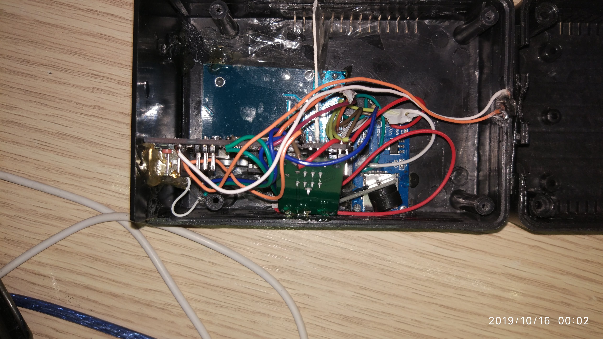
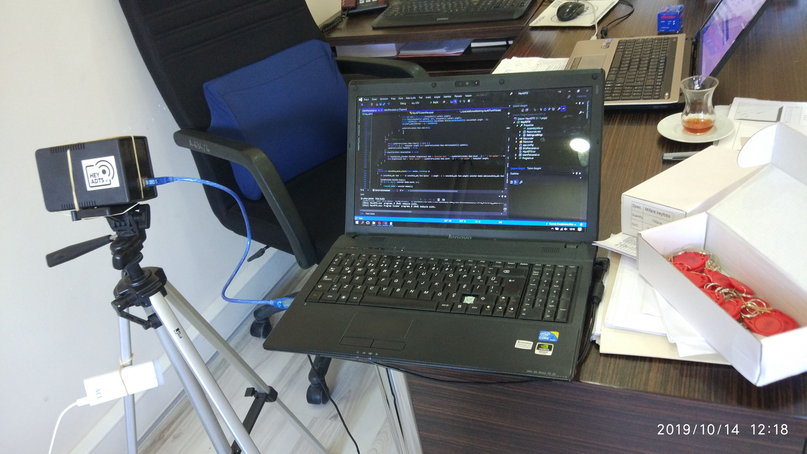
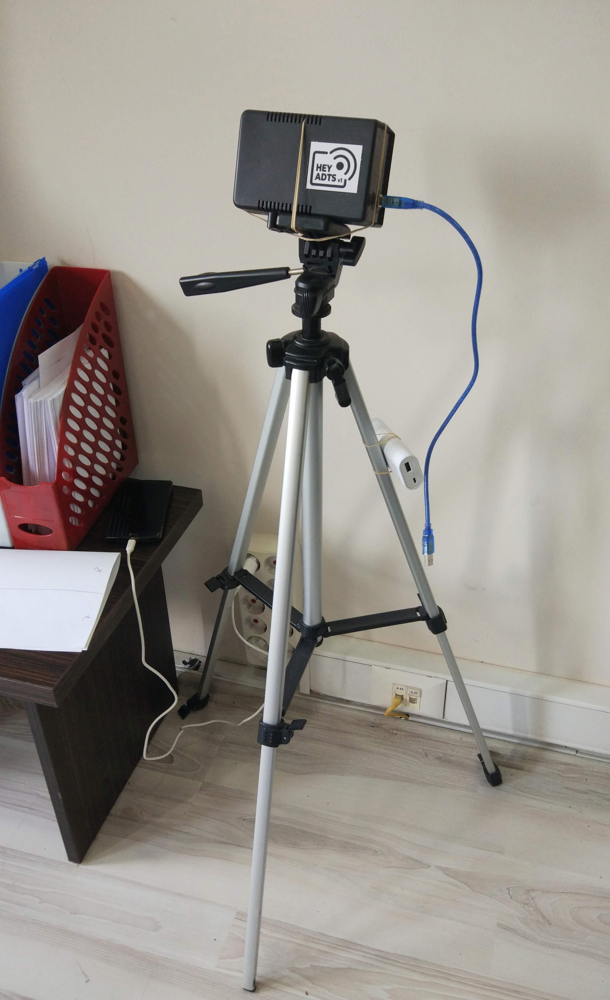
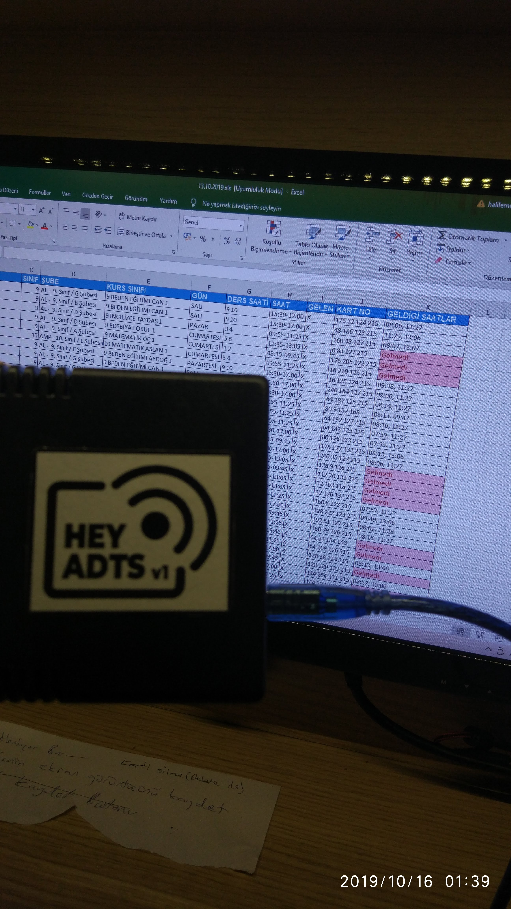

# Hey ADTS - Smart Attendance Tracking System

A complete RFID-based attendance tracking solution consisting of Arduino firmware and Windows desktop application. This system was developed to automate attendance tracking for weekend courses.Clone master branch only (without media): `git clone --single-branch --branch master https://github.com/JahnStar/Hey-AttendanceTrackingSystem.git`

## Educational Note
This project was written in 2019 during my sophomore year of high school.
Variable names and comments are in Turkish, which reflects the learning environment and local development practices at the time.
It represents my learning journey and problem-solving approach developed through self-teaching from online resources.
The project demonstrates integration of multiple technologies including embedded programming, desktop application development, and hardware interfacing - all learned independently to solve a real-world problem of tracking attendance for weekend courses.

## Project Gallery

<div align="center">
  
  
  
  
</div>

*Original hardware setup from October 2019 - Arduino Uno with MFRC522 RFID reader, SD card module, and RTC*

### System Demo
[Watch the system assembled](https://creative.jahnstar.com/?video_url=https://raw.githubusercontent.com/JahnStar/Hey-AttendanceTrackingSystem/refs/heads/media/docs/VID_20190325_001222.mp4) - Original video from March 25, 2019.<br>
[Watch the system in test](https://creative.jahnstar.com/?video_url=https://raw.githubusercontent.com/JahnStar/Hey-AttendanceTrackingSystem/refs/heads/media/docs/VID_20191008_021604.mp4) - Original video from October 8, 2019.<br>
[Watch the system in action](https://creative.jahnstar.com/?video_url=https://raw.githubusercontent.com/JahnStar/Hey-AttendanceTrackingSystem/refs/heads/media/docs/VID-20191030-WA0000.mp4) - Original video from October 30, 2019.

## Features

### Desktop Application (C#)
- **Real-time RFID Integration** - Seamless communication with Arduino hardware
- **Excel Import/Export** - Full compatibility with existing student databases
- **Advanced Search & Filtering** - Quick student lookup and attendance reports
- **Date-based Attendance Reports** - Filter by specific dates or export all records
- **Card Assignment System** - Easy RFID card assignment to students
- **Custom Database Format** - Encrypted data storage with Base64 encoding
- **Multi-panel UI** - Intuitive interface for different operations

### Arduino Firmware
- **MFRC522 RFID Reader** - Reliable card detection and reading
- **SD Card Storage** - Local data backup and logging
- **Real-time Clock (RTC)** - Accurate timestamp recording
- **Authentication System** - Secure access control with user credentials
- **Duplicate Prevention** - Prevents multiple scans within 1-minute window
- **Audio/Visual Feedback** - LED and buzzer notifications
- **Watchdog Timer** - System reliability and auto-recovery
- **Serial Communication** - Bi-directional data exchange with PC

## Hardware Requirements

### Arduino Components
- Arduino Uno/Nano
- MFRC522 RFID Reader Module
- Micro SD Card Module
- DS1302 RTC Module
- LEDs (Status & Warning)
- Buzzer (Active/Passive)
- RFID Cards/Tags
- Micro SD Card (for data storage)

### Wiring Diagram
```
MFRC522 RFID:     Arduino:
VCC        →      3.3V
RST        →      Pin 8
GND        →      GND
MISO       →      Pin 12
MOSI       →      Pin 11
SCK        →      Pin 13
SDA        →      Pin 10

SD Card Module:   Arduino:
VCC        →      5V
GND        →      GND
MISO       →      Pin 12
MOSI       →      Pin 11
SCK        →      Pin 13
CS         →      Pin 9

DS1302 RTC:       Arduino:
VCC        →      5V
GND        →      GND
CLK        →      Pin 4
DAT        →      Pin 3
RST        →      Pin 2

Components:       Arduino:
Status LED →      Pin 6
Warning LED →     Pin 5
Buzzer     →      Pin 7
```

## Software Requirements

### Desktop Application
- Windows 7/10/11
- .NET Framework 4.0 or higher
- Microsoft Excel (for import/export features)
- Available serial port for Arduino communication

### Arduino Development
- Arduino IDE 1.8.x or higher
- Required Libraries:
  - MFRC522
  - virtuabotixRTC
  - SD (built-in)
  - SPI (built-in)

## Installation

### Arduino Setup
1. Install required libraries in Arduino IDE
2. Open `HeyADTS_Arduino.ino`
3. Upload to Arduino board
4. Create `HeyADTS.TXT` file on SD card with format: `YourUsername/YourPassword/`
5. Insert SD card and connect hardware according to wiring diagram

### Desktop Application
1. Connect Arduino via USB
2. Run `HeyADTS.exe`
3. Configure COM port settings
4. Import student database via Excel file

## Usage

### Initial Setup
1. **Hardware**: Assemble Arduino circuit and insert programmed SD card
2. **Software**: Launch desktop application and establish serial connection
3. **Database**: Import student list from Excel file
4. **Card Assignment**: Use the card assignment panel to link RFID cards to students

### Daily Operation
1. Students scan their RFID cards on the reader
2. Arduino validates and logs attendance to SD card
3. Desktop application displays real-time attendance updates
4. Generate reports by selecting specific dates
5. Export attendance data to Excel for record keeping

### Data Management
- **Import**: Excel files with student information
- **Export**: Attendance reports in Excel format
- **Backup**: Automatic local storage on SD card
- **Search**: Quick student lookup by various criteria

## System Architecture

```
┌─────────────────┐    Serial    ┌──────────────────┐
│   Arduino       │ ◄──────────► │   Desktop App    │
│   - RFID Reader │              │   - Student DB   │
│   - SD Storage  │              │   - Reports      │
│   - RTC Module  │              │   - Card Mgmt    │
└─────────────────┘              └──────────────────┘
         │
         ▼
┌─────────────────┐
│   SD Card       │
│   - Attendance  │
│   - Backups     │
│   - Config      │
└─────────────────┘
```

## File Formats

### Arduino SD Card Files
- `KAYITLAR.TXT` - Attendance records: `(cardId)date?time)`
- `HeyADTS.TXT` - Authentication: `username/password/`

### Desktop Application
- `.heydb` - Project files with Base64 encoded data
- Excel import/export compatibility
- Custom data structures for efficient processing

## Configuration

### Arduino Settings
```cpp
// Pin definitions
int rfidRST = 8;      // RFID reset pin
int rfidSS = 10;      // RFID slave select
int sdCS = 9;         // SD card chip select
int uyariLed = 5;     // Warning LED
int led = 6;          // Status LED  
int zil = 7;          // Buzzer

// Authentication
String girisAdi = "Yonetici1";
String girisSifresi = "0000";
```

### Desktop Application
- Configurable serial port settings
- Customizable column headers for student data
- Adjustable time filters for attendance reports

## Troubleshooting

### Common Issues
- **Arduino not connecting**: Check COM port and baud rate (9600)
- **SD card errors**: Ensure proper formatting (FAT32) and file permissions
- **RFID not reading**: Verify wiring and card compatibility
- **Time issues**: Check RTC battery and initialization

### Debug Features
- Serial monitor output for Arduino diagnostics
- Desktop application status indicators
- Audio/visual feedback for system state

### Clone only master branch
`git clone --single-branch --branch master https://github.com/JahnStar/Hey-AttendanceTrackingSystem.git`

## License
MIT License - See LICENSE file for details

Developed by Halil Emre Yildiz (c) Copyright 2019